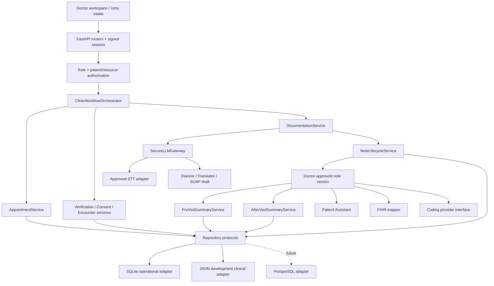

# Target Clinic-Agent Architecture

## Design

MedFlowAI is a modular monolith for the FYP: one FastAPI process, deterministic clinic services, narrowly scoped AI components, and replaceable repositories. It is intentionally not a microservice or autonomous-agent mesh.

## Authority Rules

1. LLMs may classify, translate, summarize, or draft; they cannot authenticate, authorize, book, transition workflow state, approve notes, or write records directly.
2. Every route derives the actor from the signed backend session and rechecks the patient/resource association.
3. Agents receive explicit task inputs. They do not share unrestricted memory or call one another directly.
4. The orchestrator validates every state change after a service result.
5. Only the current `APPROVED_BY_DOCTOR` note version can feed patient-facing summaries, FHIR clinical documents, or coding suggestions.
6. Audio retention needs both encounter consent and an enabled server setting; failure cleanup always deletes chunks.

## Replacement Boundaries

- Provider adapters can change without changing clinical services.
- JSON repositories can be replaced with PostgreSQL implementations of the same protocols.
- The FHIR mapper can feed a HealthLake, HAPI FHIR, or other reviewed client.
- Coding providers can be injected only after the clinic approves a source and licensing terms.

## Trust Boundaries

- Browser and all patient/transcript/note text are untrusted.
- Session identity and authorization decisions are server controlled.
- LLM output is untrusted until schema, evidence, clinical, and doctor review gates pass.
- External AI and future EHR/coding endpoints are separate data processors requiring deployment review.
