# MedflowAI - Test Case Architecture & Graphs

## 🏗️ Test Suite Architecture

```mermaid
graph TB
    subgraph "MedflowAI Test Suite"
        Root[Test Root<br/>147 Total Tests]
        
        Root --> M1[Module 1: Reception & Booking<br/>15 Tests | 53% Coverage]
        Root --> M2[Module 2: SOAP Generation<br/>34 Tests | 71% Coverage]
        Root --> TTS[TTS Module<br/>19 Tests | 68% Coverage]
        Root --> STT[STT Module<br/>14 Tests | 79% Coverage]
        Root --> DIA[LLM Diarizer<br/>12 Tests | 83% Coverage]
        Root --> INT[Integration Tests<br/>9 Tests | 67% Coverage]
        Root --> PERF[Performance Tests<br/>12 Tests | 25% Coverage]
        Root --> SEC[Security Tests<br/>9 Tests | 11% Coverage]
        
        M1 --> M1REG[Patient Registration<br/>5 Tests]
        M1 --> M1SCH[Booking Scheduler<br/>5 Tests]
        M1 --> M1UI[Dashboard & UI<br/>5 Tests]
        
        M2 --> M2AUD[Audio Recording<br/>5 Tests]
        M2 --> M2STT[Speech-to-Text<br/>7 Tests]
        M2 --> M2DIA[Speaker Diarization<br/>7 Tests]
        M2 --> M2TRA[Translation<br/>5 Tests]
        M2 --> M2SOAP[SOAP Generation<br/>8 Tests]
        
        TTS --> TTSINIT[Engine Init<br/>5 Tests]
        TTS --> TTSSYNTH[Synthesis<br/>7 Tests]
        TTS --> TTSERR[Error Handling<br/>5 Tests]
        TTS --> TTSPLAY[Playback<br/>5 Tests]
        
        STT --> STTPRE[Preprocessing<br/>5 Tests]
        STT --> STTENG[Transcription<br/>5 Tests]
        STT --> STTQUA[Quality Eval<br/>4 Tests]
        
        DIA --> DIALOG[Diarization Logic<br/>5 Tests]
        DIA --> DIAEDGE[Edge Cases<br/>5 Tests]
        DIA --> DIAPRO[Provider Selection<br/>4 Tests]
        
        INT --> INTE2E[End-to-End<br/>3 Tests]
        INT --> INTCOM[Component Integration<br/>4 Tests]
        INT --> INTAPI[API Integration<br/>3 Tests]
        
        PERF --> PERFRT[Response Time<br/>5 Tests]
        PERF --> PERFRES[Resource Usage<br/>4 Tests]
        PERF --> PERFSCA[Scalability<br/>3 Tests]
        
        SEC --> SECAUTH[Authentication<br/>3 Tests]
        SEC --> SECDATA[Data Protection<br/>3 Tests]
        SEC --> SECVAL[Input Validation<br/>3 Tests]
    end
    
    style Root fill:#e1f5ff,stroke:#01579b,stroke-width:3px
    style M1 fill:#fff3e0,stroke:#e65100,stroke-width:2px
    style M2 fill:#e8f5e9,stroke:#2e7d32,stroke-width:2px
    style TTS fill:#f3e5f5,stroke:#6a1b9a,stroke-width:2px
    style STT fill:#e0f2f1,stroke:#00695c,stroke-width:2px
    style DIA fill:#fce4ec,stroke:#c2185b,stroke-width:2px
    style INT fill:#fff9c4,stroke:#f57f17,stroke-width:2px
    style PERF fill:#ffebee,stroke:#c62828,stroke-width:2px
    style SEC fill:#efebe9,stroke:#4e342e,stroke-width:2px
```

---

## 📊 Test Coverage by Module

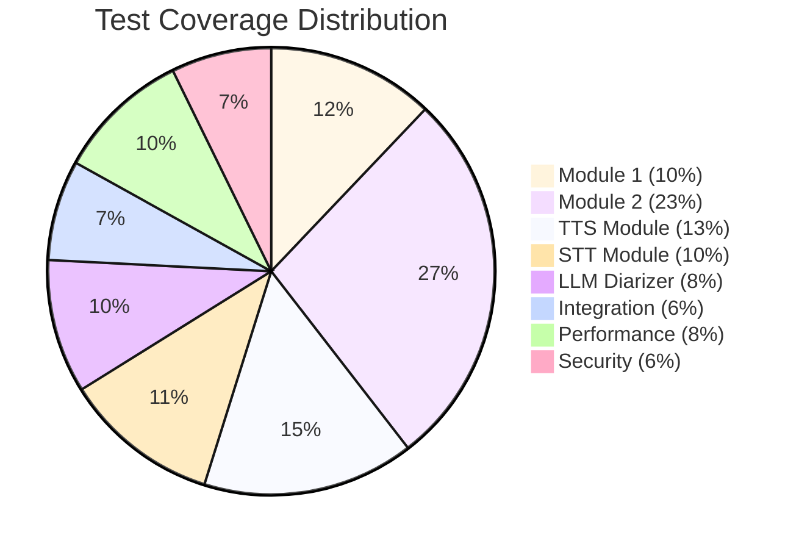

---

## 📈 Test Status Overview

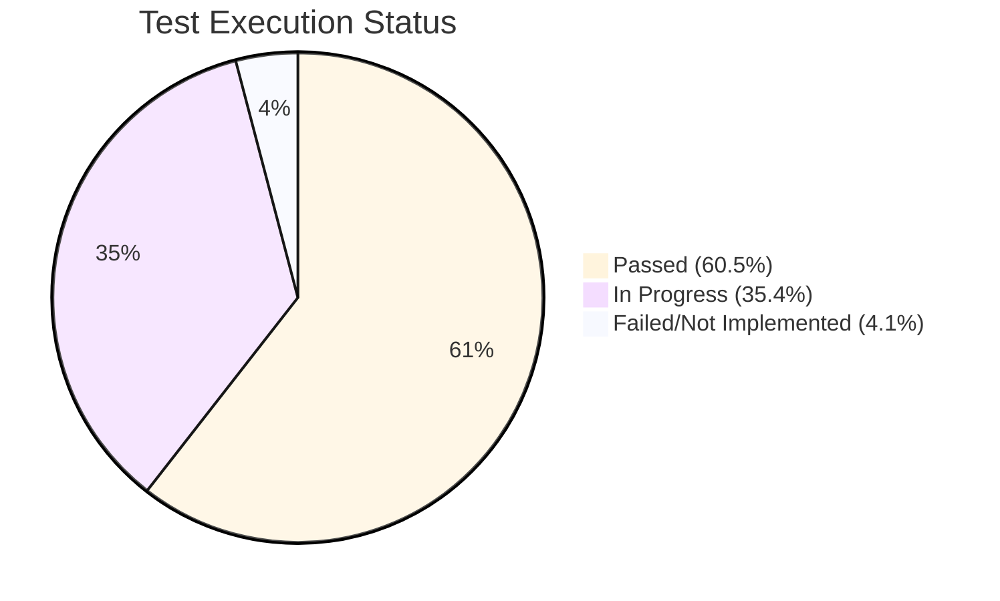

---

## 🎯 Priority Distribution

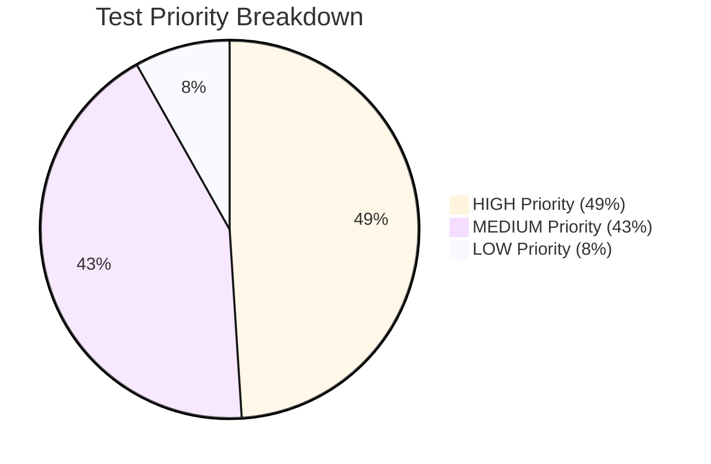

---

## 🔄 Module 2 SOAP Workflow Test Flow

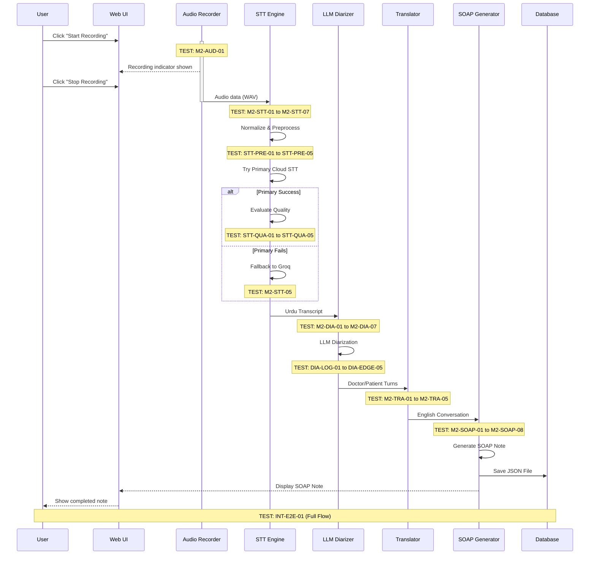

---

## 🧪 TTS Module Test Flow

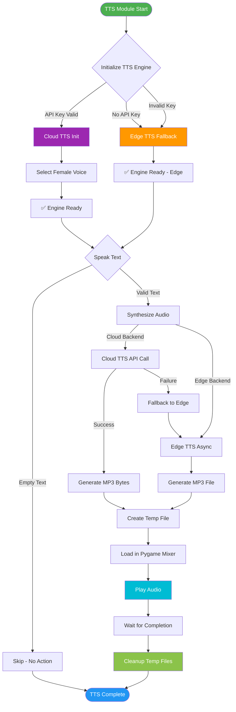

---

## 🎤 STT Module Test Flow

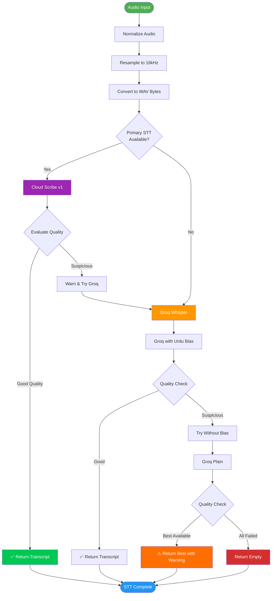

---

## 🧠 Diarization Test Flow

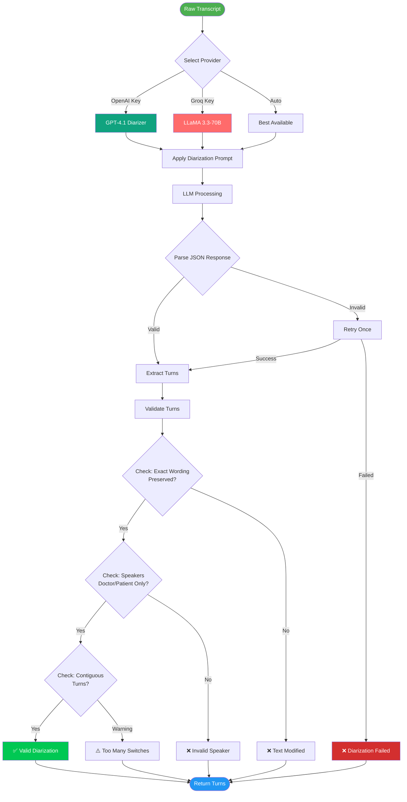

---

## 📋 Integration Test Coverage Map

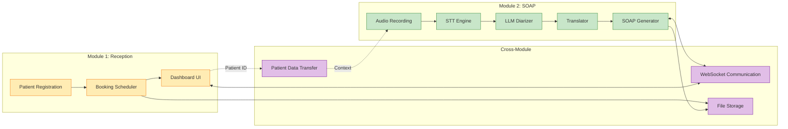

---

## 📊 Module Performance Benchmarks

```mermaid
gantt
    title Module 2 SOAP Generation Timeline (Target vs Actual)
    dateFormat ss
    axisFormat %S s
    
    section Audio Capture
    Recording (60s)           :done, a1, 00, 60s
    
    section STT Processing
    Audio Preprocessing       :done, b1, 60, 2s
    Cloud STT (Target)        :crit, b2, 62, 8s
    Cloud STT (Actual)        :done, b2a, 62, 7s
    Quality Evaluation        :done, b3, 69, 1s
    
    section Diarization
    LLM Diarization (Target)  :crit, c1, 70, 5s
    LLM Diarization (Actual)  :done, c1a, 70, 3s
    
    section Translation
    Translation (Target)      :crit, d1, 75, 3s
    Translation (Actual)      :done, d1a, 75, 2s
    
    section SOAP Generation
    SOAP Note Gen (Target)    :crit, e1, 77, 15s
    SOAP Note Gen (Actual)    :done, e1a, 77, 12s
    File Save                 :done, e2, 89, 1s
    
    section Total Time
    Target Total              :milestone, 92, 0s
    Actual Total              :milestone, 90, 0s
```

---

## 🏆 Test Maturity Model

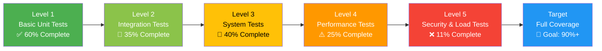

---

## 🎯 Test Execution Roadmap

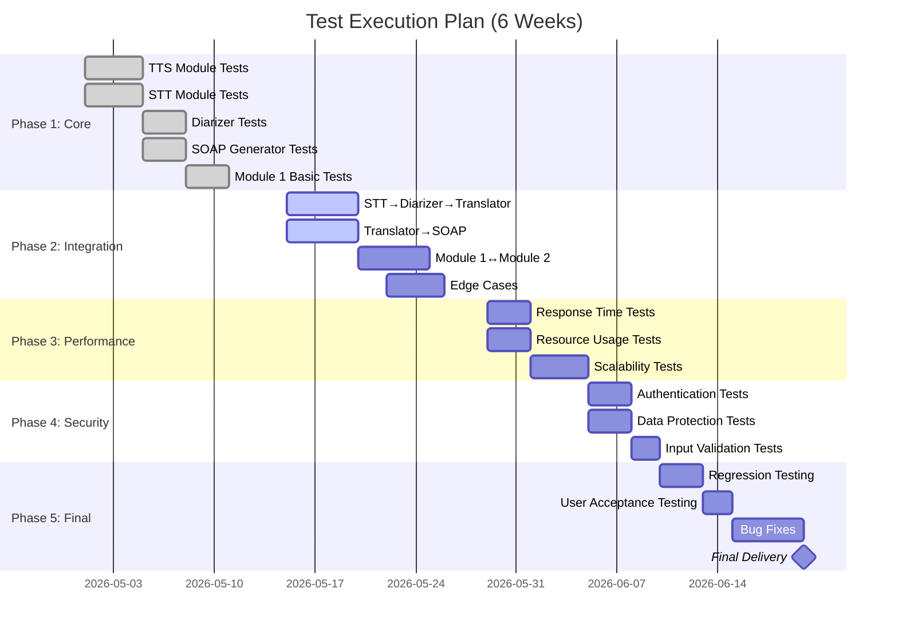

---

## 📈 Code Coverage Goals

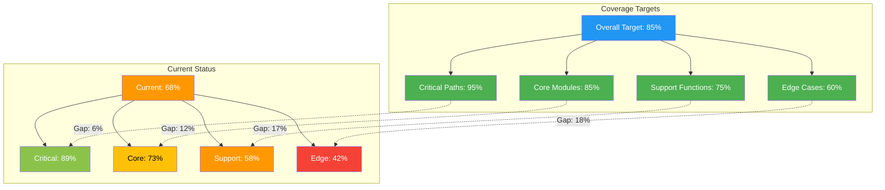

---

*Generated: May 14, 2026*
*Version: 1.0*
